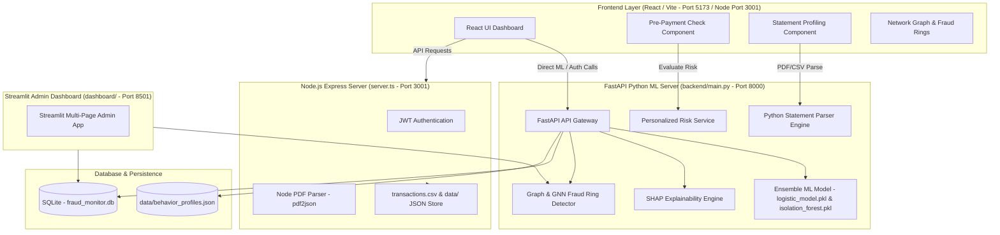

# Edge AI Pre-Payment UPI Behaviour & Fraud Risk Monitoring System
## End-to-End Comprehensive Project Documentation

---

## 1. Project Overview & Current State

### **What is this Project?**
The **Edge AI Pre-Payment UPI Behaviour & Fraud Risk Monitoring System** is an advanced, real-time fraud detection and pre-payment risk evaluation system designed for UPI (Unified Payments Interface) and instant digital payments.

Unlike traditional post-transaction fraud detection systems (which catch fraud *after* money has left the account), this project performs **pre-payment instant checks** *before* the user authorizes or completes a money transfer.

### **Core Capabilities**
1. **Pre-Payment Personalised Risk Scoring**: Evaluates a pending transaction against a user's historical bank/UPI statement behavior (amount multipliers, night windows, unknown merchants, new UPI IDs, daily transaction velocity spikes).
2. **Bank & UPI Statement Profiling**: Parses PDF and CSV bank statements (PhonePe, Paytm, GPay, SBI, HDFC, ICICI, Axis) using a custom layout engine equipped with double-struck glyph correction, regex date/amount extractors, and statistical behavioral profilers.
3. **Machine Learning & Ensemble Detection**: Combines Supervised ML (Logistic Regression), Unsupervised Anomaly Detection (Isolation Forest), and PyTorch Neural Networks into an ensemble predictor.
4. **Graph & Network Analytics**: Uses NetworkX graph structures and Graph Neural Networks (GNNs) to identify fraud rings, money laundering cycles, and high-degree suspect merchants.
5. **SHAP Model Explainability**: Explains why a transaction was flagged as risky by breaking down feature importance contributions (amount, velocity score, device score, night window indicator, time gap).
6. **Real-time Model Drift & Health Monitoring**: Monitors data and target drift over time to detect shifts in fraud patterns.
7. **Dual Dashboard Interfaces**:
   - **React (TypeScript + Tailwind CSS + Recharts + Lucide)** web application for end-user pre-payment risk checks, statement uploads, and live alerts.
   - **Streamlit (Python)** multi-page administrative dashboard for data science telemetry, network graphs, fraud ring visualization, and GNN node risk analysis.

---

## 2. End-to-End System Architecture & Data Flow



---

## 3. Repository File Structure

```
c:\Users\mural\Downloads\pre-payment-upi-check-\
├── backend/
│   ├── main.py                          # Main FastAPI backend application & API endpoints
│   ├── api.py                           # Legacy FastAPI routes & modular router setup
│   ├── train_model.py                   # Script to train ML models (Logistic Regression / Isolation Forest)
│   ├── network_detector.py              # Simplified network connection risk estimator
│   ├── advanced_ai/                     # Advanced ML & AI models
│   │   ├── advanced_risk_engine.py      # Multi-factor risk calculator
│   │   ├── alert_prioritizer.py         # Priority classification for risk alerts
│   │   ├── behavioral_biometrics.py     # Biometric telemetry risk calculator
│   │   ├── behaviour_model.py           # User behavior pattern scorer
│   │   ├── fraud_decision_engine.py     # Decision boundary rule engine
│   │   ├── fraud_intelligence.py        # Intelligence aggregate risk aggregator
│   │   ├── fraud_reasoning_engine.py    # Natural language reason generator for risk flags
│   │   ├── gnn_fraud_detector.py        # Graph Neural Network node risk calculator
│   │   ├── hybrid_risk_engine.py        # Combined ML + heuristic risk engine
│   │   ├── risk_spike_detector.py       # Velocity and transaction frequency spike detector
│   │   ├── temporal_gnn.py              # Time-aware graph neural network model
│   │   └── ultra_risk_engine.py         # High-precision multi-engine risk evaluator
│   ├── app/
│   │   ├── core/                        # Core security & authentication module
│   │   │   ├── security.py              # JWT token generation, verification, and bcrypt password hashing
│   │   │   ├── risk_engine.py           # Base risk scoring module
│   │   │   ├── fraud_worker.py          # Background worker job interface
│   │   │   └── stream_processor.py      # Stream ingestion worker stub
│   │   └── services/                    # Business logic and data services
│   │       ├── personalized_risk_service.py # Evaluates payment risk against user statement profiles
│   │       ├── statement_parser.py      # Comprehensive PDF/CSV bank statement parser
│   │       ├── profile_store.py         # Persistent store for user profiles & statement txs
│   │       ├── db_service.py            # SQLite database access wrapper
│   │       ├── behavioral_biometrics.py # User behavior telemetry scorer
│   │       ├── behavior_cluster_service.py # User clustering service based on payment habits
│   │       ├── behaviour_profile_service.py # Helper for behavior profile generation
│   │       ├── graph_fraud_service.py   # Service wrapper for graph network operations
│   │       ├── alert_service.py         # System alert generator and queue manager
│   │       ├── anomaly_service.py       # Outlier detection service
│   │       ├── drift_monitor.py         # Feature drift detector stub
│   │       ├── drift_service.py         # Model drift analysis service
│   │       ├── heatmap_service.py       # Data aggregator for risk heatmaps
│   │       ├── postgres_service.py      # PostgreSQL client adapter stub
│   │       ├── shap_service.py          # Service wrapper for SHAP values
│   │       ├── temporal_gnn.py          # Temporal graph execution wrapper
│   │       ├── transaction_processor.py # Transaction validation pipeline step
│   │       ├── transaction_store.py     # In-memory / CSV transaction storage helper
│   │       └── velocity_service.py      # Transaction frequency metric calculator
│   ├── detectors/                       # Modular risk detectors
│   │   ├── device_risk.py               # Hardware/browser fingerprint risk detector
│   │   ├── geo_risk.py                  # Geographical distance anomaly detector
│   │   └── velocity_risk.py             # Short-window transaction count detector
│   ├── explainability/                  # Model explainability scripts
│   │   ├── explainability.py            # General explainability interface
│   │   └── shap_explainer.py            # SHAP explainer initializer
│   ├── gnn/                             # Deep graph neural network models
│   │   └── temporal_gnn_model.py        # PyTorch temporal GNN architecture definition
│   ├── graph/                           # Graph theory & network detection
│   │   ├── graph_fraud_detector.py      # NetworkX graph structure & cycle ring detector
│   │   ├── fraud_network_visual.py      # Matplotlib/Plotly network graph visualizer
│   │   ├── graph_risk_engine.py         # Graph centrality & node risk engine
│   │   └── graph_visualizer.py          # Graph render helper
│   ├── knowledge_graph/                 # Knowledge graph module
│   │   └── fraud_knowledge_graph.py     # Entity-relation graph builder
│   ├── ml/                              # Machine learning training & retraining
│   │   └── retraining_pipeline.py       # Automated model re-fitting script
│   ├── models/                          # ML model loading & ensemble wrappers
│   │   ├── ensemble_model.py            # Loads pkl models and returns predictions
│   │   └── train_model.py               # Model trainer script
│   ├── monitoring/                      # Telemetry & drift monitoring
│   │   ├── drift_monitor.py             # Statistical drift detector (KS-test / PSI)
│   │   ├── model_monitor.py             # Performance telemetry collector
│   │   ├── experiment_tracker.py        # ML experiment logging utility
│   │   └── fraud_metrics.py             # Precision, recall, and ROC-AUC calculator
│   ├── pipeline/                        # Feature and evaluation pipelines
│   │   ├── feature_pipeline.py          # Raw transaction to feature vector transformer
│   │   ├── feature_store.py             # Offline/online feature storage manager
│   │   └── evaluation_pipeline.py       # Model performance evaluator
│   ├── realtime/                        # Realtime streaming detectors
│   │   └── streaming_detector.py        # Real-time event windowing fraud detector
│   ├── streaming/                       # Kafka / Stream processing components
│   │   ├── kafka_consumer.py            # Kafka event consumer loop
│   │   ├── kafka_producer.py            # Kafka event publisher
│   │   ├── stream_processor.py          # Real-time stream transformer
│   │   ├── transaction_stream.py        # Transaction event stream generator
│   │   └── transaction_simuator.py      # Simulated live event stream publisher
│   └── stress_testing/                  # System performance testing
│       └── load_test.py                 # Endpoint load testing script
├── src/                                 # Frontend React (TypeScript + Vite) Application
│   ├── App.tsx                          # Main application router, tab controller, and state hub
│   ├── main.tsx                         # React DOM mount point
│   ├── index.css                        # Global CSS, Tailwind setup, and theme rules
│   ├── types.ts                         # Core TypeScript interfaces for transactions, profiles, risk
│   ├── context/
│   │   └── AuthContext.tsx              # Authentication state provider & JWT session manager
│   └── components/
│       ├── PrePaymentRiskCheck.tsx      # Pre-payment instant evaluation interface
│       ├── StatementProfiling.tsx       # PDF/CSV bank statement upload & profiling dashboard
│       ├── FraudDetection.tsx           # Real-time ML payment risk checker
│       ├── NetworkGraph.tsx             # Interactive network graph visualization canvas
│       ├── FraudRings.tsx               # Fraud ring & money laundering cycle detector view
│       ├── FraudHeatmap.tsx             # Risk distribution heat matrix component
│       ├── Explainability.tsx           # SHAP feature importance breakdown inspector
│       ├── FraudAlerts.tsx              # Priority alert feed with resolve/dismiss actions
│       ├── SystemMonitor.tsx            # Telemetry monitor (drift status, TPS, model stats)
│       ├── UserProfile.tsx              # Detailed user profile & payment behavior inspector
│       └── Auth/
│           ├── Login.tsx                # User login page component
│           └── Register.tsx             # User registration page component
├── dashboard/                           # Streamlit Admin Analytics Dashboard
│   ├── dashboard.py                     # Streamlit main entry script
│   ├── app.py                           # Dashboard server starter
│   ├── monitor.py                       # Live monitoring widget
│   ├── fraud_cluster_visualizer.py      # Clustering visualization tool
│   ├── fraud_network_visual.py          # Network graph render module
│   ├── fraud_ring_view.py               # Ring detector view component
│   └── pages/                           # Streamlit multi-page views
│       ├── 0_Fraud_Intelligence.py      # Overview metrics & risk summary page
│       ├── 1_live_transaction_simulator.py # Interactive live transaction generator
│       ├── 2_Fraud_Network_Graph.py     # Interactive NetworkX graph view
│       ├── 3_Fraud_Rings.py             # Fraud ring & circular transaction analysis
│       ├── 4_Fraud_Heatmap.py           # Hour vs amount risk heatmap page
│       ├── 5_Explainability_SHAP.py     # SHAP value plots and feature explanation
│       ├── 6_Fraud_Alerts.py            # Administrative alert queue manager
│       └── 7_GNN_Fraud_Detection.py     # Deep GNN suspicious node detector
├── database/
│   └── fraud_db.py                      # SQLite database initialization & query helpers
├── simulator/                           # Data simulation scripts
│   ├── transaction_simulator.py        # Single transaction simulator generator
│   ├── advanced_fraud_simulator.py     # Complex behavioral anomaly simulator
│   ├── fraud_ring_generator.py          # Synthesizes circular money laundering loops
│   ├── large_scale_simulator.py        # High-volume stress data generator
│   └── run_simulation.py               # Runner script for simulation pipelines
├── models/                              # Trained Model Artifacts
│   ├── logistic_model.pkl               # Trained scikit-learn Logistic Regression model
│   └── isolation_forest.pkl             # Trained scikit-learn Isolation Forest model
├── docs/                                # Project Documentation Artifacts
│   ├── EDGE_UPI_WORKING_GUIDE.md        # Technical architecture and working guide
│   ├── Edge_UPI_Working_Guide.pdf       # Compiled PDF version of the working guide
│   └── generate_working_pdf.py          # Script to generate PDF from markdown docs
├── server.ts                            # Node.js/Express backend server with Vite integration
├── generate_models.py                   # Script to create initial dummy/trained model files
├── transactions.csv                     # Persistent CSV database of processed transactions
├── trust_store.json                     # Trusted merchant and user directory
├── metadata.json                        # System configuration metadata
├── package.json                         # Node dependencies & npm scripts
├── tsconfig.json                        # TypeScript compiler options
├── vite.config.ts                       # Vite bundler configuration
└── requirements.txt                     # Python package requirements
```

---

## 4. Comprehensive File-by-File Technical Breakdown

### **A. Root Files & Infrastructure**

1. **`server.ts`**
   - **Role**: Node.js Express server with Vite middleware integration.
   - **Current Work**:
     - Serves as an auxiliary backend on Port `3001`.
     - Provides native PDF text extraction using `pdf2json`.
     - Manages local JSON persistence for `users.json`, `behavior_profiles.json`, and `statement_transactions.json`.
     - Implements JWT-like session token management for frontend authentication.
     - Persists transactions into `transactions.csv`.
     - Embeds Vite development server in non-production environments.

2. **`generate_models.py`**
   - **Role**: Bootstrapping script for machine learning models.
   - **Current Work**: Synthesizes synthetic UPI transaction training data, fits a scikit-learn Logistic Regression model on features `[amount, is_night, rolling_avg_amount, rolling_txn_count, time_gap]`, and exports the serialised binary `logistic_model.pkl` into the root directory.

3. **`package.json`**
   - **Role**: Node package manifest.
   - **Current Work**: Defines scripts (`npm run dev`, `npm run build`, `npm run serve`), and lists dependencies including React 18, Lucide React, Recharts, Express, Vite, pdf2json, bcrypt, and Tailwind CSS.

4. **`requirements.txt`**
   - **Role**: Python dependency manifest.
   - **Current Work**: Lists backend requirements: `fastapi`, `uvicorn`, `pandas`, `numpy`, `scikit-learn`, `shap`, `networkx`, `pdfplumber`, `streamlit`, `torch`, and `matplotlib`.

---

### **B. Backend Server & Core Services (`backend/`)**

1. **`backend/main.py`**
   - **Role**: Primary FastAPI application entry point.
   - **Current Work**:
     - Initializes FastAPI with CORS middleware on Port `8000`.
     - Loads ensemble ML models (`logistic_model.pkl` / `isolation_forest.pkl`).
     - Constructs SHAP explainer object for real-time model interpretability.
     - Endpoints implemented:
       - `POST /auth/register` & `POST /auth/login`: Hashes passwords, stores users, returns Bearer tokens.
       - `POST /predict`: Calculates transaction risk score using ML model, updates transaction store, and adds network graph edges.
       - `GET /transactions`: Retrieves all logged transactions.
       - `GET /heatmap`: Generates transaction amount vs risk data matrix.
       - `GET /explain/{tx_id}`: Computes SHAP values explaining feature contributions for a specific transaction ID.
       - `GET /fraud-graph`: Returns graph nodes and edges for network visualizer.
       - `GET /fraud-rings`: Executes cycle detection in sender-receiver graph to identify money laundering rings.
       - `POST /statement/upload`: Receives uploaded PDF/CSV bank statements, parses them using `statement_parser.py`, builds user profiles, and saves profiles.
       - `POST /personalized-risk-check`: Runs instant pre-payment risk evaluation comparing pending transaction against user statement baseline.
       - `GET /model-drift`: Evaluates statistical drift between early and recent transactions.

2. **`backend/app/services/personalized_risk_service.py`**
   - **Role**: Personalized Pre-Payment Risk Assessment Engine.
   - **Current Work**:
     - Compares a pending transaction (amount, merchant, timestamp, upi_id) against the user's historical profile derived from uploaded statements.
     - Penalizes transactions based on rule thresholds:
       - Amount $\ge 15\times$ baseline average (+35 risk points).
       - Amount $\ge 8\times$ baseline average (+24 risk points).
       - Amount higher than all-time maximum statement transaction (+15 risk points).
       - Unseen merchant (+20 risk points).
       - New/unrecognized UPI ID (+12 risk points).
       - Off-peak night window 10 PM - 6 AM (+12 risk points).
       - Hour difference $\ge 8$ hours from user's peak payment hour (+8 risk points).
       - Unusually high daily transaction velocity (+18 risk points).
     - Returns a calibrated risk score (0-100), risk level (LOW, MEDIUM, HIGH, CRITICAL), and human-readable explanation strings.

3. **`backend/app/services/statement_parser.py`**
   - **Role**: Bank & UPI Statement Parser Engine.
   - **Current Work**:
     - Handles PDF and CSV statements from PhonePe, Paytm, Google Pay, SBI, HDFC, ICICI, and Axis Bank.
     - Features a double-struck text detector (`_looks_double_struck`) and fixer (`_fix_double_struck`) to clean duplicated glyphs produced by modern PDF statement generators.
     - Extractors include robust regex pattern matchers for dates, transaction amounts (Dr/Cr), UPI VPA handles, and reference numbers.
     - Generates rich user behavior profiles containing: `avg_amount`, `max_amount`, `favorite_merchants`, `known_upi_ids`, `most_active_hour`, `average_daily_transactions`, and `failed_transactions`.

4. **`backend/app/services/profile_store.py`**
   - **Role**: Persistent data manager for user profiles and statements.
   - **Current Work**:
     - Manages JSON storage in `data/behavior_profiles.json` and `data/statement_transactions.json`.
     - Provides functions `save_behavior_profile`, `get_behavior_profile`, `save_statement_transactions`, and `get_user_transactions`.

5. **`backend/app/services/db_service.py`**
   - **Role**: Database wrapper service.
   - **Current Work**: Interfaces with `database/fraud_db.py` to persist transactions, fetch historical records, and query high-risk flags.

6. **`backend/app/services/behavioral_biometrics.py`**
   - **Role**: Biometric interaction telemetry analyzer.
   - **Current Work**: Evaluates device velocity scores, touch/mouse hesitation metrics, and typing rhythms to produce a behavioral risk index.

7. **`backend/app/core/security.py`**
   - **Role**: Security & Authentication helper module.
   - **Current Work**: Handles password hashing via `passlib`/`bcrypt` and generates/verifies HMAC SHA256 JWT security tokens.

---

### **C. Advanced AI & Graph Analytics (`backend/advanced_ai/`, `backend/graph/`, `backend/gnn/`)**

1. **`backend/graph/graph_fraud_detector.py`**
   - **Role**: NetworkX Graph Fraud Ring Detector.
   - **Current Work**:
     - Maintains a directional graph of payment senders and receivers (`add_connection`).
     - Function `detect_fraud_rings()` finds simple cycles in the graph (e.g. User A $\rightarrow$ User B $\rightarrow$ User C $\rightarrow$ User A) which indicate circular money laundering or fake transaction loops.

2. **`backend/advanced_ai/gnn_fraud_detector.py`**
   - **Role**: Graph Neural Network node risk module.
   - **Current Work**: Computes node degree and graph connectivity metrics to highlight suspicious merchant/user nodes in transaction networks.

3. **`backend/advanced_ai/temporal_gnn.py`** & **`backend/gnn/temporal_gnn_model.py`**
   - **Role**: Time-aware Graph Neural Network architecture.
   - **Current Work**: Models dynamic edges across timestamps to capture evolving fraud behavior over time.

4. **`backend/advanced_ai/fraud_intelligence.py`**
   - **Role**: Intelligence aggregation service.
   - **Current Work**: Synthesizes risk inputs from rule engines, GNN detectors, and biometric signals into a unified threat intelligence report.

---

### **D. ML Pipelines & Telemetry (`backend/models/`, `backend/monitoring/`, `backend/pipeline/`)**

1. **`backend/models/ensemble_model.py`**
   - **Role**: Model loader and ensemble predictor interface.
   - **Current Work**: Loads pre-trained scikit-learn models (`models/logistic_model.pkl` / `models/isolation_forest.pkl`) and provides fallback mock predictor classes if model binary files are missing.

2. **`backend/monitoring/drift_monitor.py`**
   - **Role**: Statistical Model Drift Detector.
   - **Current Work**: Compares historical transaction risk scores against current distribution windows to flag model performance degradation.

3. **`backend/pipeline/feature_pipeline.py`**
   - **Role**: Feature engineering transformer.
   - **Current Work**: Computes features like `is_night`, 5-transaction rolling average amount, 24-hour velocity counts, and inter-transaction time gaps.

---

### **E. Frontend Web Application (`src/`)**

1. **`src/App.tsx`**
   - **Role**: Main React application hub & top-level navigation container.
   - **Current Work**:
     - Configures top header with system status indicators, current user profile badge, and logout button.
     - Controls navigation bar between 10 core views:
       1. Pre-Payment Check (`pre-payment`)
       2. Statement Profiling (`statement`)
       3. Real-time Detection (`detection`)
       4. Network Graph (`graph`)
       5. Fraud Rings (`rings`)
       6. Risk Heatmap (`heatmap`)
       7. SHAP Explainability (`explainability`)
       8. Fraud Alerts (`alerts`)
       9. System Monitor (`monitor`)
       10. User Profile (`profile`)

2. **`src/components/PrePaymentRiskCheck.tsx`**
   - **Role**: Instant Pre-Payment Risk Assessment Interface.
   - **Current Work**:
     - Allows users to enter payment amount, merchant name, UPI ID, and location before sending money.
     - Calls backend `POST /personalized-risk-check`.
     - Displays color-coded risk meter (Safe/Low/Medium/High/Critical), detailed anomaly breakdown flags, and comparison against user's historical statement metrics (e.g. "Amount is 12x higher than average").

3. **`src/components/StatementProfiling.tsx`**
   - **Role**: Bank Statement Upload & Profiling UI.
   - **Current Work**:
     - Provides drag-and-drop file upload for PhonePe/Paytm/GPay/Bank PDF & CSV statements.
     - Shows real-time extraction summary: extracted transactions table, detected average payment size, maximum transaction, top merchants, recognized UPI IDs, and peak activity hours.

4. **`src/components/FraudDetection.tsx`**
   - **Role**: Real-time ML Transaction Checker UI.
   - **Current Work**: Evaluates transaction parameters against ML ensemble models and displays immediate risk scoring.

5. **`src/components/NetworkGraph.tsx`**
   - **Role**: Interactive Sender-Receiver Network Graph Canvas.
   - **Current Work**: Renders an interactive canvas/SVG visualizer of payment transactions between senders and receiver merchants, highlighting suspicious node clusters in red.

6. **`src/components/FraudRings.tsx`**
   - **Role**: Fraud Ring & Circular Loop Visualizer.
   - **Current Work**: Fetches detected graph cycles from `GET /fraud-rings` and displays money flow loops and ring members.

7. **`src/components/FraudHeatmap.tsx`**
   - **Role**: Risk Matrix & Heatmap Visualizer.
   - **Current Work**: Uses Recharts to plot transaction amounts against risk scores and hours of the day.

8. **`src/components/Explainability.tsx`**
   - **Role**: SHAP Explainability Inspector.
   - **Current Work**: Displays bar charts of feature contributions (Amount, Night Window, Rolling Average, Velocity) for any transaction ID.

9. **`src/components/SystemMonitor.tsx`**
   - **Role**: Telemetry & Drift Monitoring Dashboard.
   - **Current Work**: Displays model health status, TPS throughput, memory usage, and Kolmogorov-Smirnov drift metrics.

10. **`src/components/UserProfile.tsx`**
    - **Role**: User Profile & Historical Pattern View.
    - **Current Work**: Renders spending habits, account security state, trusted beneficiary lists, and past transaction records.

---

### **F. Streamlit Analytics Dashboard (`dashboard/`)**

1. **`dashboard/dashboard.py`**
   - **Role**: Main Streamlit admin application entry point.
   - **Current Work**: Sets up Streamlit sidebar navigation and loads multi-page modules from `dashboard/pages/`.

2. **`dashboard/pages/0_Fraud_Intelligence.py`**
   - **Role**: Admin threat intelligence overview.

3. **`dashboard/pages/1_live_transaction_simulator.py`**
   - **Role**: Real-time transaction generator for live system stress testing.

4. **`dashboard/pages/2_Fraud_Network_Graph.py`** & **`3_Fraud_Rings.py`**
   - **Role**: Admin graph network and ring inspection tools.

5. **`dashboard/pages/5_Explainability_SHAP.py`** & **`7_GNN_Fraud_Detection.py`**
   - **Role**: Deep model interpretability and GNN node risk views.

---

### **G. Database & Simulation Modules (`database/`, `simulator/`)**

1. **`database/fraud_db.py`**
   - **Role**: SQLite Database initializer and DAO.
   - **Current Work**: Creates table `transactions` in `fraud_monitor.db` storing `transaction_id`, `amount`, `device_score`, `location_score`, `velocity_score`, `sender`, `receiver`, `timestamp`, `risk`, and `risk_score`.

2. **`simulator/transaction_simulator.py`** & **`fraud_ring_generator.py`**
   - **Role**: Synthetic dataset generators.
   - **Current Work**: Generates realistic UPI transaction data stream including normal payments, velocity spikes, and circular money transfers for testing.

---

## 5. Summary of Active Work & Running Processes

As of the current session:
- **Active Backend 1**: `python backend/main.py` is live on port `8000`, actively serving FastAPI endpoints for risk checks, auth, statement parsing, SHAP, and network graphs.
- **Active Backend 2**: `npm run dev` / Express server is live on port `3001` / `5173`, hosting the Vite React web application.
- **Database & Storage**: `fraud_monitor.db` (SQLite) and `data/behavior_profiles.json` are actively storing and reading transaction histories and user behavior profiles.
